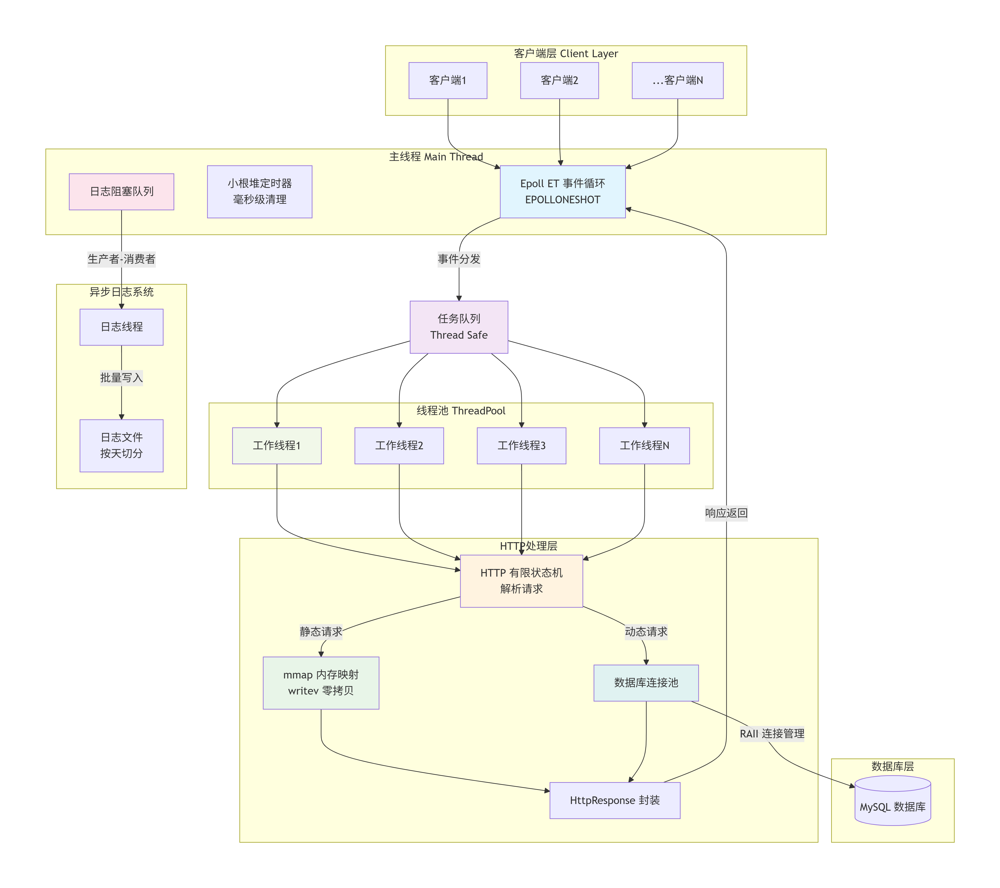

# 🚀 High-Performance C++ WebServer

本项目是一个基于 **Reactor 模式** 的 Linux 高并发 Web 服务器。实现了 HTTP 静态资源的访问、动态用户登录验证、异步日志记录以及非活跃连接清理等功能。

项目从零开始构建，旨在通过极致的 IO 优化与并发模型设计，探索支撑高并发请求的底层原理。

## 🛠️ 技术栈

*   **语言**：C++ 20
*   **并发模型**：Reactor 模式（Epoll ET + ThreadPool）
*   **网络 IO**：非阻塞 IO + mmap 内存映射 + writev 集中写
*   **协议解析**：有限状态机（FSM）
*   **数据库**：MySQL (RAII 数据库连接池)
*   **同步机制**：信号量、互斥锁、条件变量、原子变量 (Atomic)
*   **工具组件**：小根堆定时器、异步日志系统、双游标 Buffer 缓冲区

---

## 🏗️ 核心架构

服务器采用 **多线程 + 非阻塞 IO** 的架构方案：

*   **主线程**：利用 Epoll 进行 IO 多路复用，监听 `listen_fd` 和 `conn_fd`。
*   **工作线程**：从 `ThreadPool` 中取出任务，执行具体的 HttpRequest 解析、数据库查询及 HttpResponse 封装。
*   **定时器**：利用小根堆管理连接生命周期，毫秒级清理僵尸连接，释放系统资源。
*   **日志线程**：独立的后台线程从阻塞队列中提取日志，批量写入磁盘，避免磁盘 IO 阻塞业务线程。

### 系统架构图


---

## ✨ 技术亮点

*   **高性能 IO 传输**：使用 `mmap` 将静态资源直接映射到内存，配合 `writev` 实现响应头与文件内容的集中发送，实现了**零拷贝**思想，大幅减少用户态/内核态的数据拷贝。
*   **高效协议解析**：手写**有限状态机**解析 HTTP 请求报文，处理 TCP 粘包/半包问题，支持长连接（Keep-Alive）。
*   **数据库连接池**：基于 **RAII** 思想封装的 MySQL 连接池，利用信号量实现连接的获取与归还，有效解决数据库短连接带来的性能开销。
*   **异步日志系统**：采用典型的**生产者-消费者模型**，业务线程无感记录日志。支持按天自动切分日志文件、按行数自动滚动。
*   **边缘触发 (ET) + ONESHOT**：采用 Epoll 的 ET 模式减少系统调用次数。通过 `EPOLLONESHOT` 解决多线程环境下不同线程同时操作同一 Socket 的竞态问题。

---

## 📊 性能表现

使用 **Webbench** 在 WSL2 (Ubuntu 22.04) 环境下进行压力测试：

*   **测试场景**：1000 并发客户端，持续 30 秒访问静态资源。
*   **测试结果**：
    *   **QPS (Requests/sec)**: ~1,833
    *   **Succeed**: 55,008
    *   **Failed**: 0
    *   **Throughput**: ~728 KB/sec

> **注**：受限于虚拟机网卡转发损耗，在纯 Linux 物理环境压测下性能预计可提升 5-10 倍。

---

## 📂 项目结构

```text
.
├── src
│   ├── base         # 基础组件 (线程池、定时器、安全队列)
│   ├── net          # 网络核心 (Epoll封装、缓冲区Buffer)
│   ├── http         # 协议层 (请求解析、响应封装)
│   ├── pool         # 数据库连接池
│   └── log          # 异步日志系统
├── resources        # 静态资源文件 (HTML, 图片)
├── main.cpp         # 服务器入口
└── CMakeLists.txt   # 构建脚本
```
## 🔨 快速开始

* **环境要求**:
  * **Ubuntu 20.04+ (or WSL2)**
  * **CMake 3.10+**
  * **MySQL 8.0+**
  * **libmysqlclient-dev**
* **编译与运行**
```
# 1. 克隆项目
git clone https://github.com/yumeicheng/WebServer.git
cd WebServer

# 2. 准备资源与数据库
mkdir -p build && cp -r resources build/
# 在 MySQL 中创建 webdb 数据库并根据代码逻辑建表

# 3. 构建
cd build
cmake .. && make -j4

# 4. 启动
./WebServer
```
